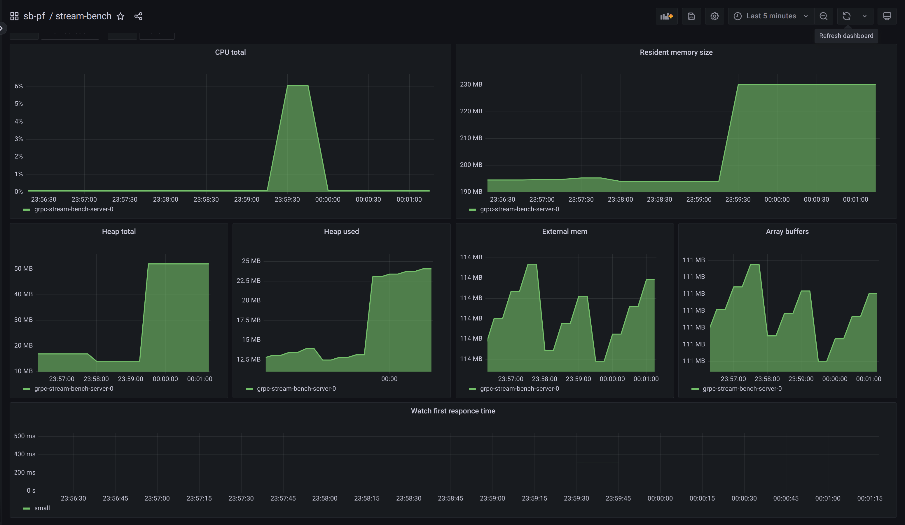

# grpc-stream-bench

## Common info

That is example of simple server-streaming service made for benchmark purposes\
Service stores data in memory, shares it with its clients, and keeps their cache consistent with updates notification like etcd [watch](https://etcd.io/docs/v3.6/dev-guide/interacting_v3/#watch-historical-changes-of-keys)

Server is written in TypeScript for `NodeJS`, client - `golang`

Server has two rRPC methods:

```proto
service StreamBench {
    rpc Watch(WatchRequest) returns (stream WatchResponse);
    rpc WatchSeparated(WatchRequest) returns (stream SeparatedWatchResponse);
}
```

`Watch` method will return 1 message with array of `N` key-value pairs

```proto
message WatchResponse {
    repeated KV kv = 1;
}
```

`WatchSeparated` method will return `N` messages each with single key-value pair

```proto
message SeparatedWatchResponse {
    uint32 part = 1;
    uint32 parts = 2;
    KV kv = 3;
}
```

Client make Watch or WatchSeparated request for specified folder and it will receive **all KVs from that folder**

This repo has **4** branches:

-   main - js-object in cache
-   protobuf-cache - protobuf buffer in cache
-   frame-cache - gRPC frame in cache
-   protobuf-cache-2writes - protobuf buffer in cache and changed write and serializeMessage

In `main` service use original grpc-js and protobufjs serializers\
In `protobuf-cache` service use changed serializer generated by protoc\
In `frame-cache` service use changed serializer in grpc-js packet\
In `protobuf-cache-2writes` service use changed serializer generated by protoc

All branches differ from each other only in the `src/service.ts` file

---

## Benchmark details

All tests was performed in k8s cluster.\
**Single** service pod and **25** client pods.\
Each client pod contains one gRPC client which makes **20** Watch or WatchSeparated calls at the same time. In total it it **500** rpcs approximately at the same time

Message type `mono` means that client using `Watch` rpc to receive single message with array of KV pairs\
Message type `separated` means that client using `WatchSeparated` rpc to receive each KV pair in a single message

|               | KV pairs | Each pair size, bytes | Total size, bytes |
| :-----------: | :------: | :-------------------: | :---------------: |
| Small folder  |   1000   |         ~500          |       ~500K       |
| Medium folder |   1000   |         ~5000         |        ~5M        |
| Large folder  |   1000   |        ~50000         |       ~50M        |

---

| Message type |                                                         Cache type (link to handler)                                                         |                  Details                   |                 Small folder                 |                Medium folder                |                             Large folder                              |
| :----------: | :------------------------------------------------------------------------------------------------------------------------------------------: | :----------------------------------------: | :------------------------------------------: | :-----------------------------------------: | :-------------------------------------------------------------------: |
|     mono     |     [js-object-cache](https://github.com/mishimastar/grpc-stream-bench/blob/5019db6f3b990fc468243271a41d1e590cef6e00/src/service.ts#L40)     |       [link](#js-object-cache-mono)        |   ~5% CPU for 1min<br>~260MB RAM for 1min    | ~35% CPU for 0.75min<br>~2.75GB RAM for ... |   ~110% CPU for 0.75min<br>~55% CPU for 3.5min<br>~20GB RAM for ...   |
|  separated   |     [js-object-cache](https://github.com/mishimastar/grpc-stream-bench/blob/5019db6f3b990fc468243271a41d1e590cef6e00/src/service.ts#L75)     |     [link](#js-object-cache-separated)     |  ~12% CPU for 0.5min<br>~300MB RAM for 1min  | ~30% CPU for 1min<br>~200MB RAM for 0.5min  | ~100% CPU for 0.75min<br>~60% CPU for 2.5min<br>~280MB RAM for 3.5min |
|     mono     |     [protobuf-cache](https://github.com/mishimastar/grpc-stream-bench/blob/27f4f157d7ab3127b6cfb1a67caa866d6b6af9d8/src/service.ts#L57)      |        [link](#protobuf-cache-mono)        | ~3% CPU for 0.5min<br>~400MB RAM for 0.5min  |  ~15% CPU for 0.5min<br>~2.5GB RAM for ...  |                ~70% CPU for ...<br>~22.5GB RAM for ...                |
|  separated   |     [protobuf-cache](https://github.com/mishimastar/grpc-stream-bench/blob/27f4f157d7ab3127b6cfb1a67caa866d6b6af9d8/src/service.ts#L89)      |     [link](#protobuf-cache-separated)      | ~9% CPU for 0.5min<br>~260MB RAM for 0.5min  | ~25% CPU for 0.75min<br>~250MB RAM for 3min |    ~50% CPU for 0.5min<br>~30% CPU for 3min<br>~280MB RAM for 4min    |
|     mono     |       [frame-cache](https://github.com/mishimastar/grpc-stream-bench/blob/31306b2c693481acd9898f187b330721c75c255b/src/service.ts#L55)       |       [link](#grpc-frame-cache-mono)       | ~2% CPU for 0.5min<br>~200MB RAM for 0.5min  |  ~7% CPU for 0.5min<br>~200MB RAM for ...   |  ~12% CPU for 0.5min<br>~5% CPU for 2.5min<br>~235MB RAM for 0.5min   |
|  separated   |       [frame-cache](https://github.com/mishimastar/grpc-stream-bench/blob/31306b2c693481acd9898f187b330721c75c255b/src/service.ts#L89)       |    [link](#grpc-frame-cache-separated)     |   ~6% CPU for 0.5min<br>~230MB RAM for ...   | ~15% CPU for 0.5min<br>~230MB RAM for 1min  |   ~30% CPU for 0.5min<br>~10% CPU for 2.5min<br>~230MB RAM for ...    |
|     mono     | [protobuf-cache-2writes](https://github.com/mishimastar/grpc-stream-bench/blob/119bbba01609da2786884357461897ba4db75e01/src/service.ts#L101) |   [link](#protobuf-cache-2-writes-mono)    |   ~1% CPU for 0.5min<br>~200MB RAM for ...   |   ~3% CPU for 1min<br>~200MB RAM for ...    |    ~12% CPU for 0.25min<br>~4% CPU for 2min<br>~205MB RAM for ...     |
|  separated   | [protobuf-cache-2writes](https://github.com/mishimastar/grpc-stream-bench/blob/119bbba01609da2786884357461897ba4db75e01/src/service.ts#L135) | [link](#protobuf-cache-2-writes-separated) | ~8% CPU for 0.5min<br>~240MB RAM for 0.25min | ~12% CPU for 1min<br>~235MB RAM for 2.5min  |    ~25% CPU for 0.5min<br>~10% CPU for 2min<br>~230MB RAM for ...     |

---

## JS Object Cache mono

[Branch](https://github.com/mishimastar/grpc-stream-bench/tree/main)

### Small folder


### Medium folder


### Large folder

During this test OOM killer started to kill grpc clients


---

## JS Object Cache separated

[Branch](https://github.com/mishimastar/grpc-stream-bench/tree/main)

### Small folder


### Medium folder


### Large folder


---

## Protobuf Cache mono

Less CPU usage is expected here since the protobufjs serializer is used once when the service starts

[Branch](https://github.com/mishimastar/grpc-stream-bench/tree/protobuf-cache)

### Small folder


### Medium folder


### Large folder


---

## Protobuf Cache separated

Here we observed slightly higher CPU usage than with mono, apparently this concerns iteration and control of all created promises

[Branch](https://github.com/mishimastar/grpc-stream-bench/tree/protobuf-cache)

### Small folder


### Medium folder


### Large folder


---

## gRPC Frame Cache mono

Less CPU and RAM usage is expected here since the gRPC frame serializer is used once when the service starts, so we avoid one extra memory allocation and buffer copy for each call

[Branch](https://github.com/mishimastar/grpc-stream-bench/tree/frame-cache)

### Small folder


### Medium folder


### Large folder


---

## gRPC Frame Cache separated

[Branch](https://github.com/mishimastar/grpc-stream-bench/tree/frame-cache)

### Small folder



### Medium folder


### Large folder


---

## Protobuf Cache (2 writes) mono

Less CPU and RAM usage is expected here since the protobufjs serializer is used once when the service starts and we avoid allocating new large buffer and coppying protobuf message into it

[Branch](https://github.com/mishimastar/grpc-stream-bench/tree/protobuf-cache-2writes)

### Small folder


### Medium folder


### Large folder


---

## Protobuf Cache (2 writes) separated

Here we observed slightly higher CPU usage than with mono, apparently this concerns iteration and control of all created promises

[Branch](https://github.com/mishimastar/grpc-stream-bench/tree/protobuf-cache-2writes)

### Small folder


### Medium folder


### Large folder


---
