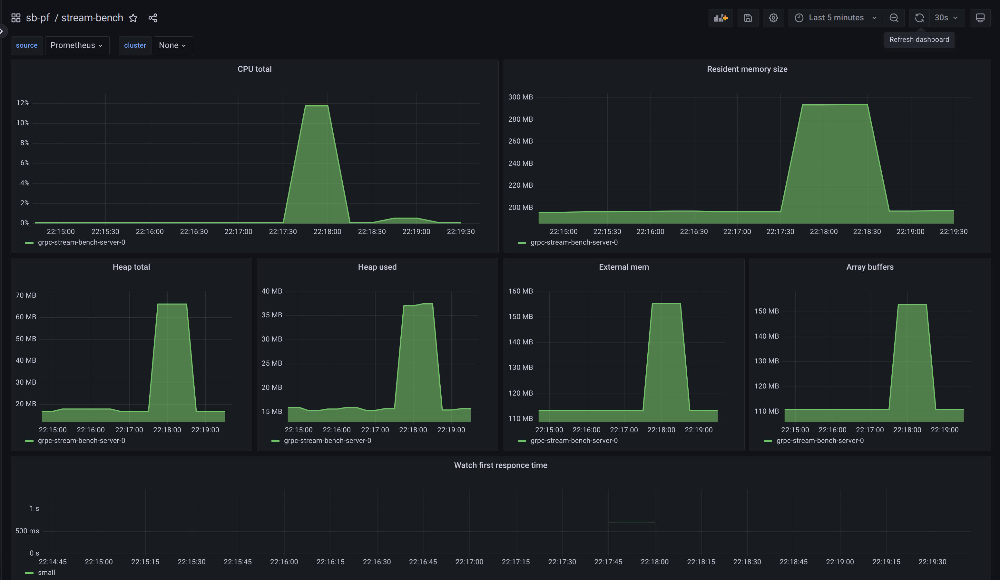

# grpc-stream-bench

## Common info

That is example of simple server-streaming service made for benchmark purposes\
Service stores data in memory, shares it with its clients, and keeps their cache consistent with updates notification like etcd [watch](https://etcd.io/docs/v3.6/dev-guide/interacting_v3/#watch-historical-changes-of-keys)\

Server is written in TypeScript for `NodeJS`, client - `golang`

Server has two rRPC methods:

```proto
service StreamBench {
    rpc Watch(WatchRequest) returns (stream WatchResponse);
    rpc WatchSeparated(WatchRequest) returns (stream SeparatedWatchResponse);
}
```

`Watch` method will return 1 message with array of `N` key-value pairs

```proto
message WatchResponse {
    repeated KV kv = 1;
}
```

`WatchSeparated` method will return `N` messages each with single key-value pair

```proto
message WatchResponse {
    repeated KV kv = 1;
}
```

Client make Watch or WatchSeparated request for specified folder and it will receive **all KVs from that folder**

---

## Summary

Message type `mono` means that client using `Watch` rpc to receive single message with array of KV pairs\
Message type `separated` means that client using `WatchSeparated` rpc to receive each KV pair in a single message

|               | KV pairs | Each pair size, bytes | Total size, bytes |
| :-----------: | :------: | :-------------------: | :---------------: |
| Small folder  |   1000   |         ~500          |       ~500K       |
| Medium folder |   1000   |         ~5000         |        ~5M        |
| Large folder  |   1000   |        ~50000         |       ~50M        |

---

| Message type |                                                     Cache type (link to handler)                                                     |               Details               |                Small folder                 |                Medium folder                |                             Large folder                              |
| :----------: | :----------------------------------------------------------------------------------------------------------------------------------: | :---------------------------------: | :-----------------------------------------: | :-----------------------------------------: | :-------------------------------------------------------------------: |
|     mono     | [js-object-cache](https://github.com/mishimastar/grpc-stream-bench/blob/5019db6f3b990fc468243271a41d1e590cef6e00/src/service.ts#L40) |    [link](#js-object-cache-mono)    |   ~5% CPU for 1min<br>~260MB RAM for 1min   | ~35% CPU for 0.75min<br>~2.75GB RAM for ... |   ~110% CPU for 0.75min<br>~55% CPU for 3.5min<br>~20GB RAM for ...   |
|  separated   | [js-object-cache](https://github.com/mishimastar/grpc-stream-bench/blob/5019db6f3b990fc468243271a41d1e590cef6e00/src/service.ts#L75) | [link](#js-object-cache-separated)  | ~12% CPU for 0.5min<br>~300MB RAM for 1min  | ~30% CPU for 1min<br>~200MB RAM for 0.5min  | ~100% CPU for 0.75min<br>~60% CPU for 2.5min<br>~280MB RAM for 3.5min |
|     mono     | [protobuf-cache](https://github.com/mishimastar/grpc-stream-bench/blob/27f4f157d7ab3127b6cfb1a67caa866d6b6af9d8/src/service.ts#L57)  |    [link](#protobuf-cache-mono)     | ~3% CPU for 0.5min<br>~400MB RAM for 0.5min |  ~15% CPU for 0.5min<br>~2.5GB RAM for ...  |                ~70% CPU for ...<br>~22.5GB RAM for ...                |
|  separated   | [protobuf-cache](https://github.com/mishimastar/grpc-stream-bench/blob/27f4f157d7ab3127b6cfb1a67caa866d6b6af9d8/src/service.ts#L89)  |  [link](#protobuf-cache-separated)  | ~9% CPU for 0.5min<br>~260MB RAM for 0.5min | ~25% CPU for 0.75min<br>~250MB RAM for 3min |    ~50% CPU for 0.5min<br>~30% CPU for 3min<br>~280MB RAM for 4min    |
|     mono     |   [frame-cache](https://github.com/mishimastar/grpc-stream-bench/blob/31306b2c693481acd9898f187b330721c75c255b/src/service.ts#L55)   |   [link](#grpc-frame-cache-mono)    | ~2% CPU for 0.5min<br>~200MB RAM for 0.5min |  ~7% CPU for 0.5min<br>~200MB RAM for ...   |  ~12% CPU for 0.5min<br>~5% CPU for 2.5min<br>~235MB RAM for 0.5min   |
|  separated   |   [frame-cache](https://github.com/mishimastar/grpc-stream-bench/blob/31306b2c693481acd9898f187b330721c75c255b/src/service.ts#L89)   | [link](#grpc-frame-cache-separated) |  ~6% CPU for 0.5min<br>~230MB RAM for ...   | ~15% CPU for 0.5min<br>~230MB RAM for 1min  |   ~30% CPU for 0.5min<br>~10% CPU for 2.5min<br>~230MB RAM for ...    |

---

## JS Object Cache mono

[Branch](https://github.com/mishimastar/grpc-stream-bench/tree/main)

### Small folder


### Medium folder


### Large folder


---

## JS Object Cache separated

[Branch](https://github.com/mishimastar/grpc-stream-bench/tree/main)

### Small folder



### Medium folder


### Large folder


---

## Protobuf Cache mono

[Branch](https://github.com/mishimastar/grpc-stream-bench/tree/protobuf-cache)

### Small folder


### Medium folder


### Large folder


---

## Protobuf Cache separated

[Branch](https://github.com/mishimastar/grpc-stream-bench/tree/protobuf-cache)

### Small folder


### Medium folder


### Large folder


---

## gRPC Frame Cache mono

[Branch](https://github.com/mishimastar/grpc-stream-bench/tree/frame-cache)

### Small folder


### Medium folder


### Large folder


---

## gRPC Frame Cache separated

[Branch](https://github.com/mishimastar/grpc-stream-bench/tree/frame-cache)

### Small folder


### Medium folder


### Large folder


---
